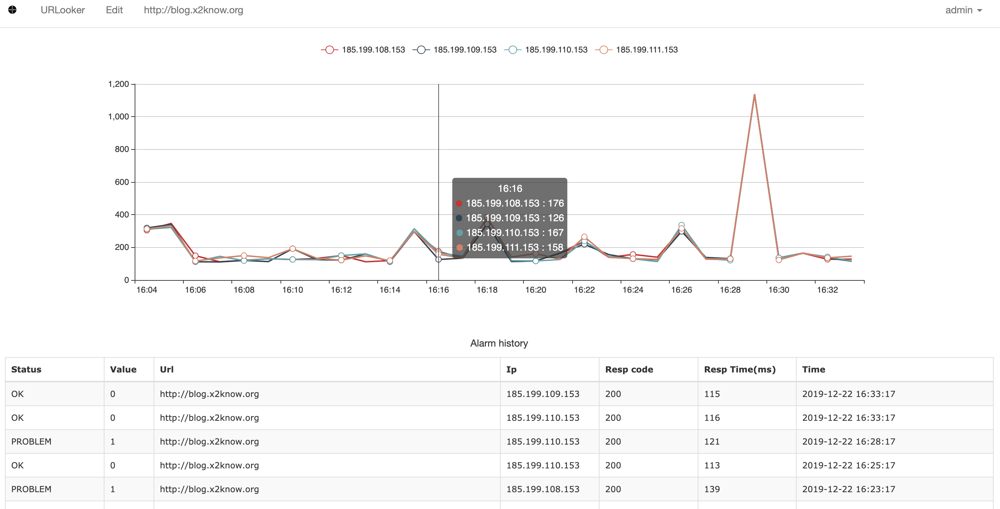
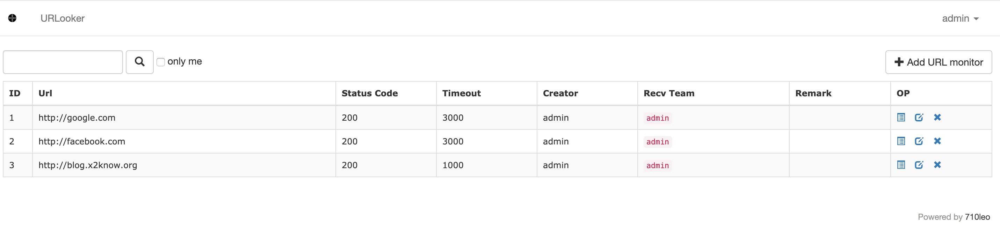

## [urlooker](https://github.com/710leo/urlooker)
enterprise-level websites monitoring system    
[English](https://github.com/710leo/urlooker)|[中文](https://github.com/710leo/urlooker/blob/master/readme_zh.md)

## Feature
- status code
- respose time
- page keyword 
- customize header
- customize post body
- support get post put method
- send to nightingale、open-falcon、statsd、prometheus

## Architecture


## ScreenShot





## FAQ
- [wiki](https://github.com/710leo/urlooker/wiki)
- [FAQ](https://github.com/710leo/urlooker/wiki/FAQ)
- default user/password：admin/password

## Install
##### install by docker

```bash
git clone https://github.com/710leo/urlooker.git
cd urlooker
docker build .
docker volume create urlooker-vol
docker run -p 1984:1984 -d --name urlooker --mount source=urlooker-vol,target=/var/lib/mysql --restart=always [CONTAINER ID]
```

##### install by code
```bash
# install dependence
yum install -y mysql-server
wget https://raw.githubusercontent.com/710leo/urlooker/master/sql/schema.sql
mysql -h 127.0.0.1 -u root -p < schema.sql

curl https://raw.githubusercontent.com/710leo/urlooker/master/install.sh|bash
cd $GOPATH/src/github.com/710leo/urlooker

# change [mysql root password]to your mysql root password
sed -i 's/urlooker.pass/[mysql root password]/g' configs/web.yml

./control start all
```

open http://127.0.0.1:1984 in browser

## Q&A
Gitter: [urlooker](https://gitter.im/urllooker/community)
