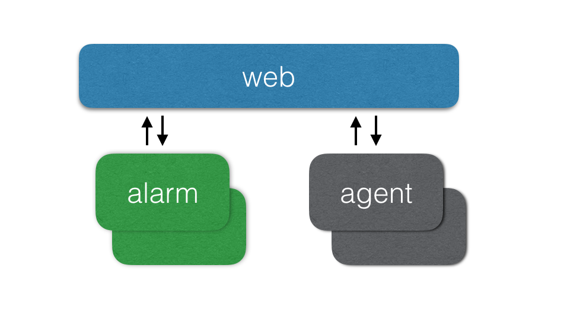
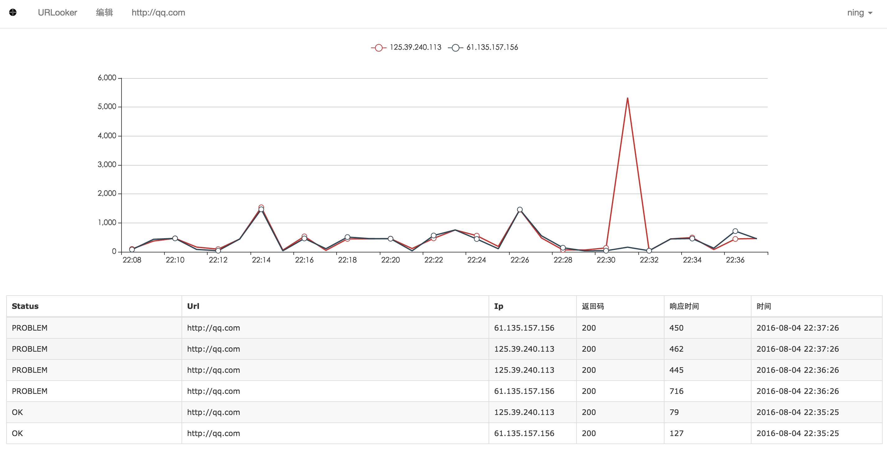
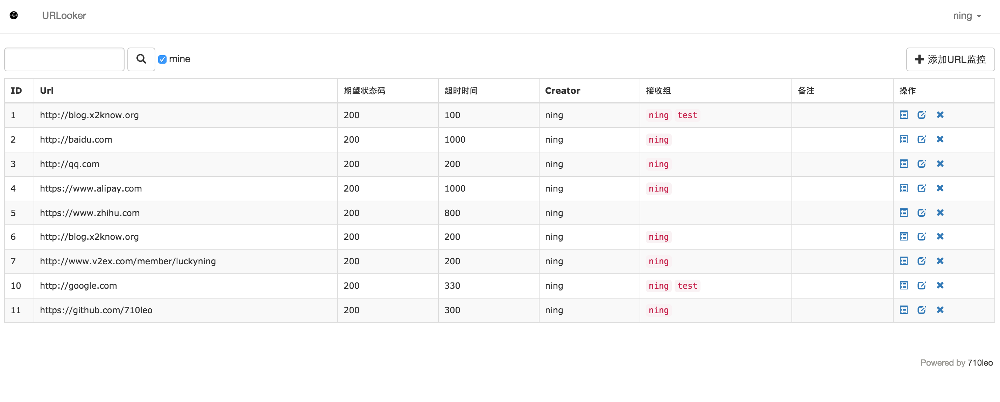
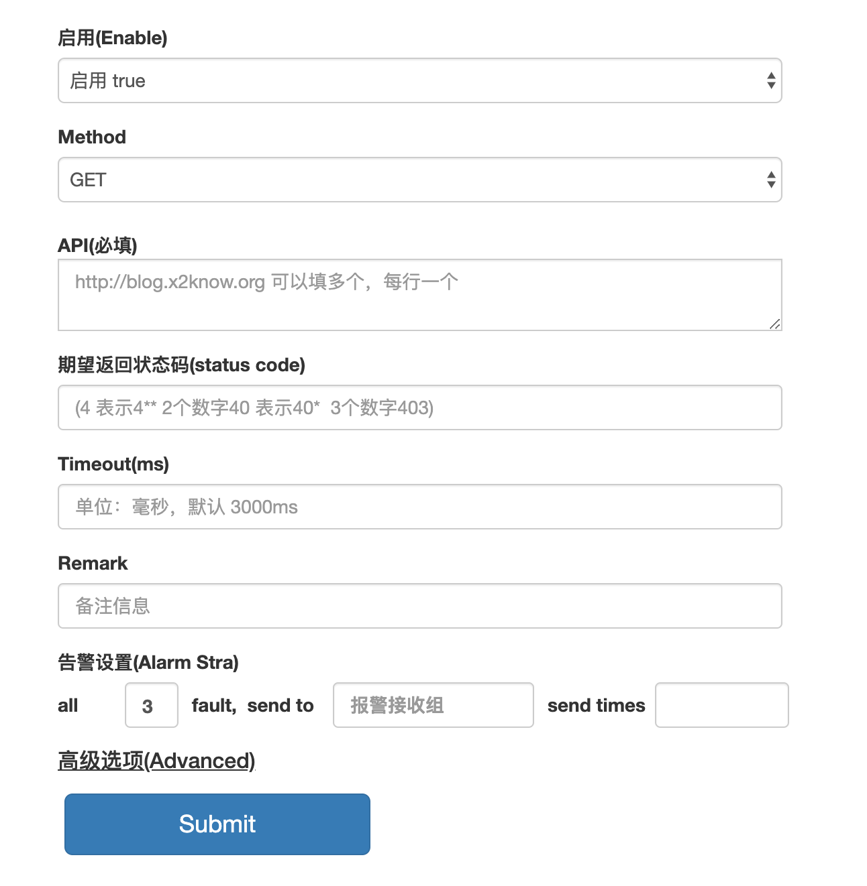

## [urlooker](https://github.com/710leo/urlooker)
监控web服务可用性及访问质量，采用go语言编写，易于安装和二次开发    
[English](https://github.com/710leo/urlooker)|[中文](https://github.com/710leo/urlooker/blob/master/readme_zh.md)

## Feature
- 返回状态码检测
- 页面响应时间检测
- 页面关键词匹配检测
- 自定义Header
- GET、POST、PUT访问
- 自定义POST BODY
- 检测结果支持推送 nightingale、open-falcon

## Architecture


## ScreenShot





## 常见问题
- [wiki手册](https://github.com/710leo/urlooker/wiki)
- [常见问题](https://github.com/710leo/urlooker/wiki/FAQ)
- 初始用户名密码：admin/password

## Install
#### docker 安装

```bash
git clone https://github.com/710leo/urlooker.git
cd urlooker
docker build .
docker volume create urlooker-vol
docker run -p 1984:1984 -d --name urlooker --mount source=urlooker-vol,target=/var/lib/mysql --restart=always [CONTAINER ID]
```

#### 源码安装

```bash
# 安装mysql
yum install -y mysql-server
wget https://raw.githubusercontent.com/710leo/urlooker/master/sql/schema.sql
mysql -h 127.0.0.1 -u root -p < schema.sql

# 安装组件
curl https://raw.githubusercontent.com/710leo/urlooker/master/install.sh|bash
cd $GOPATH/src/github.com/710leo/urlooker

# 将[mysql root password]替换为mysql root 数据库密码
sed -i 's/urlooker.pass/[mysql root password]/g' configs/web.yml

./control start all
```

打开浏览器访问 http://127.0.0.1:1984 即可

## 答疑
QQ群：556988374

## Thanks
一些功能参考了open-falcon，感谢 [UlricQin](http://ulricqin.com) & [laiwei](https://github.com/laiwei)